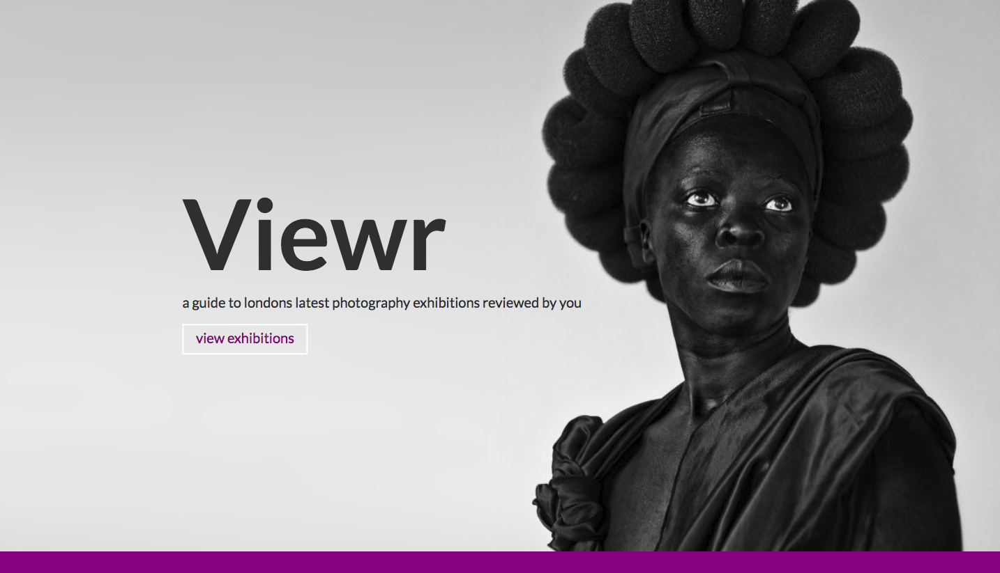
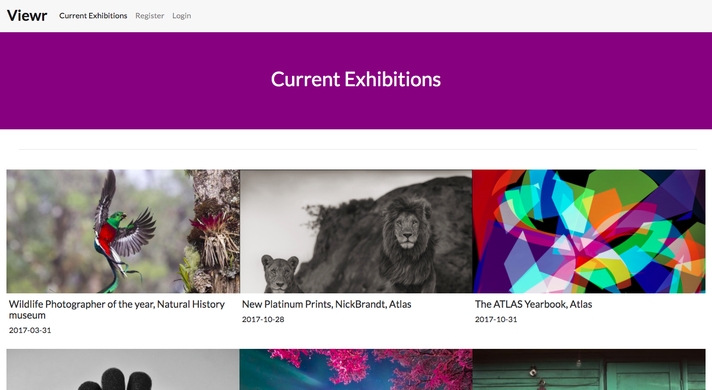
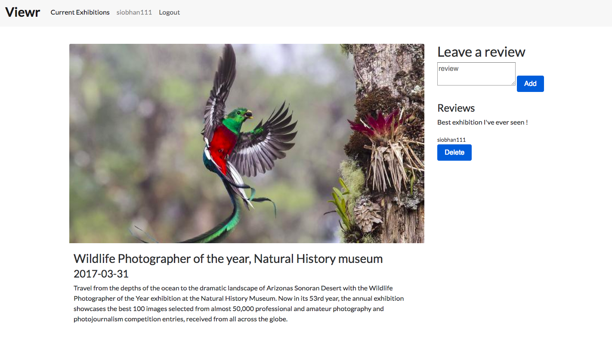
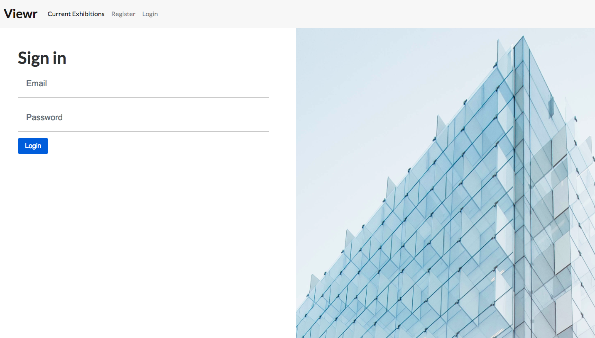

# WDI_PROJECT_2

## RESTful App with authentication - 'Viewr'

### Cover Page

### Index Page

### Show Page

### Login/Register

## Summary

My background in photography led me to come up with the idea for this app. I thought it would be interesting to create a platform for the public to add and review exhibitions they had visited. I utilized the  CRUD/RESTful concepts when creating my first full stack app, getting to know how to use Mongo make AJAX requests to my API. 

## Tech/Library Used

* Mongo, Express, Node.js
* JavaScript
* HTML5
* CSS3
* SASS
* EJS
* express-session
* morgan
* express-ejs-layouts
* body-parser
* express-flash
* bluebird

